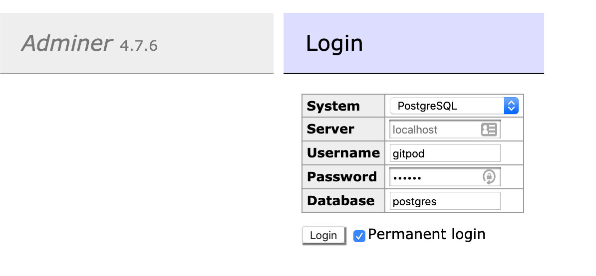

# ClickPIN - Development

GitPod is the main development environment, just run the master branch
in GitPod and enjoy a bunch of services automatically running for you:

- Postgres
- Adminer
- Hasura
- API Service
  - Node App
  - Unit tests
  - EndToEnd tests
- APP Service
  - CRA App
  - Unit tests
  - Style guide

## Postgres & Adminer

The workspace runs a persistent Postgres instance, the data is preserved
even when you put the workspace to sleep.

At the time of writing, GitPod can only expose _HTTP_ services so there is
practical way to connect to the database with external clients like _Postico_.

The workspace ships with [Adminer] which offers a web-based interface to Postgres.
You can access adminer on `port 8008`:



| prop     | value     |
| -------- | --------- |
| system   | Postgres  |
| server   | localhost |
| username | gitpod    |
| password | gitpod    |
| database | postgres  |

I suggest you check out the "Permanent login" option and avoid to re-enter the
credentials next time you open the page.

---

## Hasura

Hasura boots with the workpace, runs on `port 8080` and connects to the local
Postgres instance.

The default admin secret is "_hasura_", but you can customize it by setting up
a worspace environment variable "_HASURA_GRAPHQL_ADMIN_SECRET_":

```bash
eval $(gp env -e HASURA_GRAPHQL_ADMIN_SECRET=foobar)
```

**NOTE:** If you do so, remember to refresh the API's terminal environment
or just restart the Worspace.

> The process and logs are executed in the bottom area of the workdpace (Cmd + j)

---

## API Service

The main service runs a _Fastify_ instance on `port 8081`.

> The process and logs are executed in the bottom area of the workdpace (Cmd + j)

Two side processes start with the workspace and execute **Unit tests** and
**E2E tests** in watch mode. If you don't need them, it's best to stop (Ctrl + c).

Those process run in the right-hand sidebar.

### Migrations

The service is capable of running migrations at boot time, only when
`process.env.RUN_MIGRATIONS=true`.  
(it is defaulted to `true` when running in GitPod)

**NOTE:** When running the migrations in development mode, a test user is created.

---

## APP Service

The main service runs a _Create React App_ instance on `port 3000`.

> The process and logs are executed in the bottom area of the workdpace (Cmd + j)

When you first run the

### Tests & Styleguide

Two side processes start with the workspace and execute **Unit tests** and
**React styleguidist**. If you don't need them, it's best to stop (Ctrl + c).

React styleguidist is exposed on `port 6060`.

[adminer]: https://www.adminer.org/
